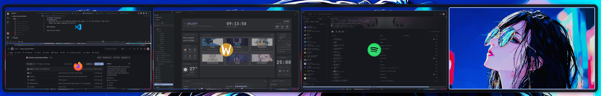
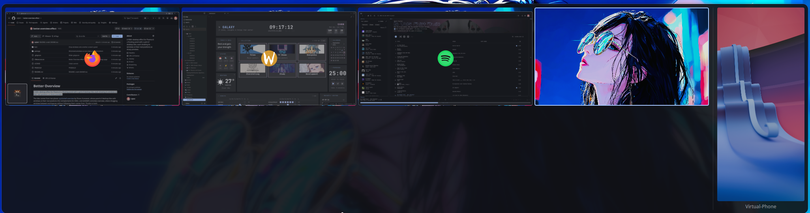
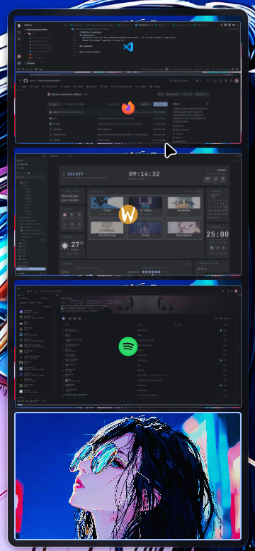
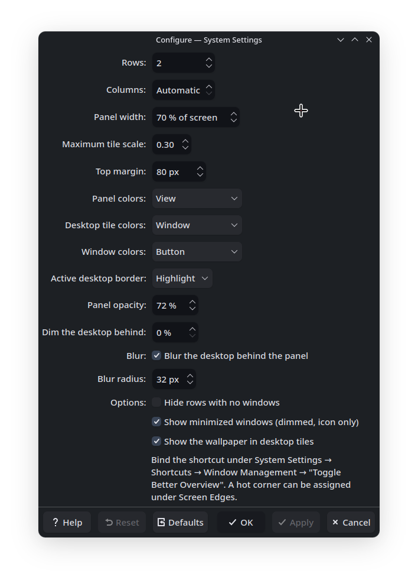

# Better Overview

A KWin desktop effect for Plasma 6: a floating grid of desktops with sharp
window previews at their real positions. Drag a window onto another desktop
to move it there without following. Inspired by
[quickshell-overview](https://github.com/Shanu-Kumawat/quickshell-overview)
and GNOME's overview.

<table>
  <tr>
    <td colspan="2" align="center">
       
      One tile per desktop, windows at their real positions
    </td>
  </tr>
  <tr>
    <td colspan="2" align="center">
       
      A second screen in the sidebar, and a minimized window as a chip in its tile
    </td>
  </tr>
  <tr>
    <td align="center" width="50%">
       
      Columns set to 1
    </td>
    <td align="center" width="50%">
       
      The settings page
    </td>
  </tr>
</table>

## Behaviour

- Click a tile to switch to that desktop. Click a window to focus it.
- Middle-click a window to close it, right-click to toggle "on all desktops".
- Drag a window onto a tile to move it there. You stay where you are.
- Arrows or `hjkl` move between desktops, `1`–`9` and `0` jump, the wheel
  steps, `Esc`/`Enter` close. Clicking outside the panel closes it.
- Minimized windows show as small icon chips along the bottom of their tile.
- With more than one screen, a sidebar shows each other screen's current
  desktop. Drop a window there to send it to that screen.
- Optional blur of the desktop behind the panel. Lower the panel opacity to
  see it.
- No key is bound by default. Set one under System Settings → Shortcuts →
  Window Management → "Toggle Better Overview".

## Licence

GPL-2.0-or-later.
